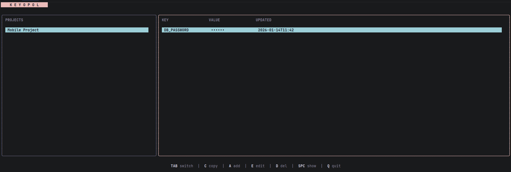
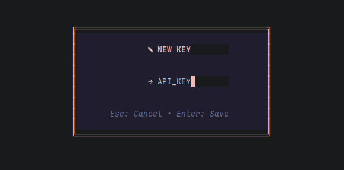
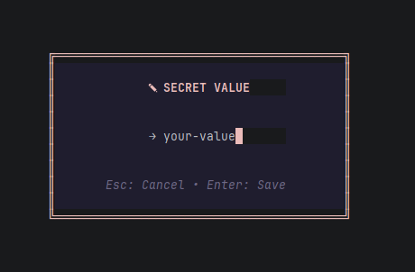
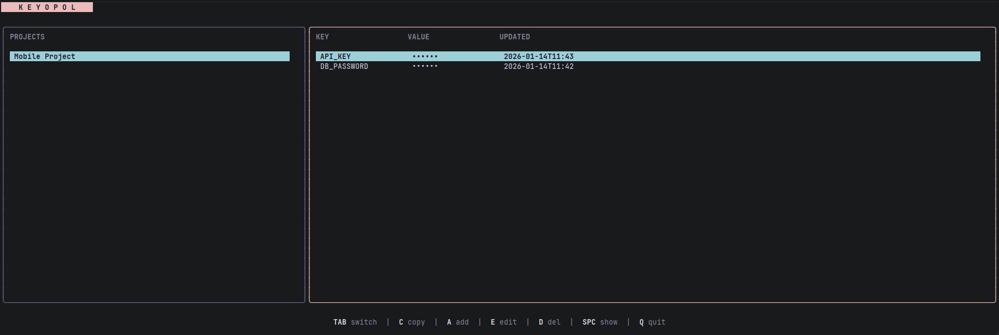

# KEYOPOL


> **Zero-knowledge, local-first secret manager for developers**

Keyopol is a terminal-based secret management tool that keeps your API keys, credentials, and environment variables encrypted and organized by project. Built with security-first principles, it ensures your master password never touches disk while providing a beautiful, keyboard-driven interface.

---

## Features

- **Zero-Knowledge Architecture** – Master key stays in RAM only, never written to disk
- **Beautiful TUI** – Elegant terminal interface with Rose Pine theme (Bubble Tea + Lipgloss)
- **Instant Clipboard Access** – Copy secrets with a single keystroke
- **Project-Scoped Organization** – Group secrets by project, not a flat list
- **Command Injection** – Run commands with secrets auto-injected as environment variables
- **Military-Grade Encryption** – AES-256-GCM with unique nonces per operation
- **Local-First** – No cloud, no servers, no third parties

---

## Installation

### Option 1: Pre-built Binaries (Recommended)

Download the latest release for your platform from [Releases](https://github.com/yourusername/keyopol/releases):

- **Windows**: `keyopol.exe`
- **Linux**: `keyopol`
- **macOS**: `keyopol`

**Add to PATH** (optional):
```bash
# Linux/macOS
sudo mv keyopol /usr/local/bin/

# Windows: Add the directory containing keyopol.exe to your PATH environment variable
```

### Option 2: Install via Go

For developers with Go installed:

```bash
go install github.com/yourusername/keyopol@latest
```

---

## Quick Start

Launch the TUI:

```bash
keyopol
```

On first run, you'll be prompted to create a master password. The encrypted database will be automatically created at:

- **Linux/macOS**: `~/.keyopol/secrets.db`
- **Windows**: `%USERPROFILE%\.keyopol\secrets.db`

### Setting Master Key via Environment Variable

```bash
export KEYOPOL_MASTER_KEY="your-secure-master-password"
keyopol
```

---

## Screenshots






## Keyboard Controls

| Key       | Action                                      |
|-----------|---------------------------------------------|
| `TAB`     | Switch between Projects and Secrets panels |
| `j` / `k` | Navigate down / up                          |
| `a`       | Add new project or secret                   |
| `e`       | Edit selected item                          |
| `d`       | Delete selected item                        |
| `c`       | Copy secret value to clipboard              |
| `SPACE`   | Toggle secret visibility                    |
| `q`       | Quit application                            |

---

## Command-Line Interface

### Run Commands with Injected Secrets

Execute any command with project secrets automatically loaded as environment variables:

```bash
keyopol run --project my-app -- npm start
keyopol run --project backend -- go run main.go
```

**How it works:**
1. Loads all secrets for the specified project
2. Decrypts them using your master key
3. Injects them as environment variables
4. Executes the command in that context

### Retrieve a Single Secret

```bash
keyopol get my-app DATABASE_URL
```

Returns the decrypted value of `DATABASE_URL` from the `my-app` project.

---

## System Architecture & Security

### Zero-Knowledge Architecture

Keyopol implements a **zero-knowledge security model**:

- **Master Key in RAM Only**: Your master password is never written to disk, config files, or the database
- **No Password Recovery**: If you lose your master key, your data is cryptographically unrecoverable
- **Local-First**: All data stays on your machine; no network calls, no telemetry

### Encryption

- **Algorithm**: AES-256-GCM (Galois/Counter Mode)
- **Nonce Generation**: Cryptographically random, unique per encryption operation
- **Key Derivation**: Master password → AES key via secure derivation

### Application Architecture

Keyopol follows the **ELM Architecture** (Model-View-Update pattern) via [Bubble Tea](https://github.com/charmbracelet/bubbletea):

```
┌─────────────────────────────────────────┐
│           UI Layer (Bubble Tea)         │
│  • Keyboard input handling              │
│  • Rendering with Lipgloss              │
│  • MVU (Model-View-Update) pattern      │
└─────────────────┬───────────────────────┘
                  │
┌─────────────────▼───────────────────────┐
│         Crypto Service Layer            │
│  • AES-256-GCM encryption/decryption    │
│  • Nonce generation                     │
│  • Key derivation from master password  │
└─────────────────┬───────────────────────┘
                  │
┌─────────────────▼───────────────────────┐
│        Storage Layer (SQLite)           │
│  • modernc.org/sqlite (CGO-free)        │
│  • Cross-platform compatibility         │
│  • Stores only encrypted data           │
└─────────────────────────────────────────┘
```

**Key Components:**
- **UI Layer**: Pure functional UI with Bubble Tea's MVU pattern
- **Crypto Service**: Stateless encryption/decryption with no key persistence
- **Storage Layer**: CGO-free SQLite for maximum portability

---

## Development

### Building from Source

```bash
git clone https://github.com/ahmettb/keyopol.git
cd keyopol
go build -ldflags="-s -w" -o keyopol
```

### Cross-Platform Compilation

```bash
# Windows
GOOS=windows GOARCH=amd64 go build -o keyopol.exe

# Linux
GOOS=linux GOARCH=amd64 go build -o keyopol

# macOS (Intel)
GOOS=darwin GOARCH=amd64 go build -o keyopol

# macOS (Apple Silicon)
GOOS=darwin GOARCH=arm64 go build -o keyopol
```

---

## Why Keyopol?

**For Developers Who Value:**
- **Privacy**: No cloud sync, no third-party access
- **Simplicity**: Single binary, no dependencies, no setup
- **Speed**: Instant access to secrets without leaving the terminal
- **Security**: Industry-standard encryption with zero-knowledge design

**Perfect For:**
- Managing local development environment variables
- Storing API keys and credentials per project
- Running scripts with secrets without hardcoding
- Keeping sensitive data out of version control

---

## Tech Stack

- **Language**: Go 1.21+
- **TUI Framework**: [Bubble Tea](https://github.com/charmbracelet/bubbletea) (ELM Architecture)
- **Styling**: [Lipgloss](https://github.com/charmbracelet/lipgloss)
- **Database**: [modernc.org/sqlite](https://gitlab.com/cznic/sqlite) (pure Go, no CGO)
- **Encryption**: Go standard library `crypto/aes`, `crypto/cipher`
- **Clipboard**: [atotto/clipboard](https://github.com/atotto/clipboard)
